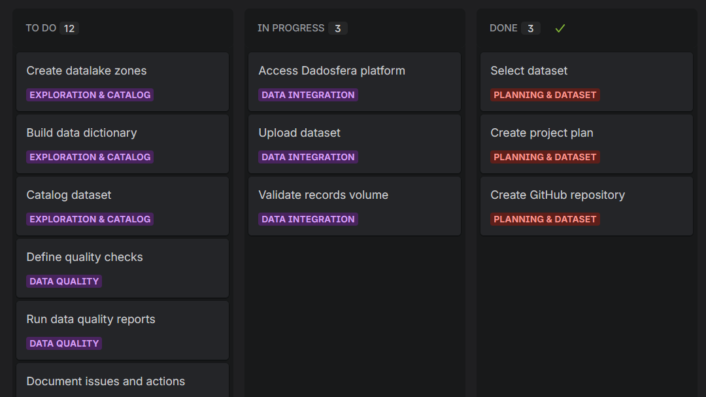

# Technical Case – Dadosfera

This repository contains the technical case developed for the Dadosfera selection process.

## Dataset
NYC Taxi Trip Records – Yellow Taxi

## Project Scope
The project follows the data lifecycle approach, covering ingestion, exploration, data quality, and analytical visualization.

## Item 0 – Project Planning

The project planning was organized using a Kanban board in Jira, following agile principles and allowing clear visualization of tasks and progress across the data lifecycle.

Below is a snapshot of the Kanban board used during the project execution.

