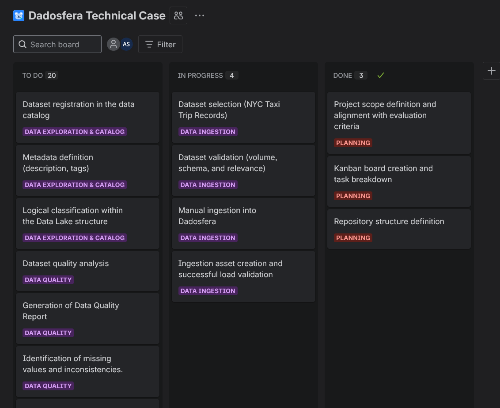
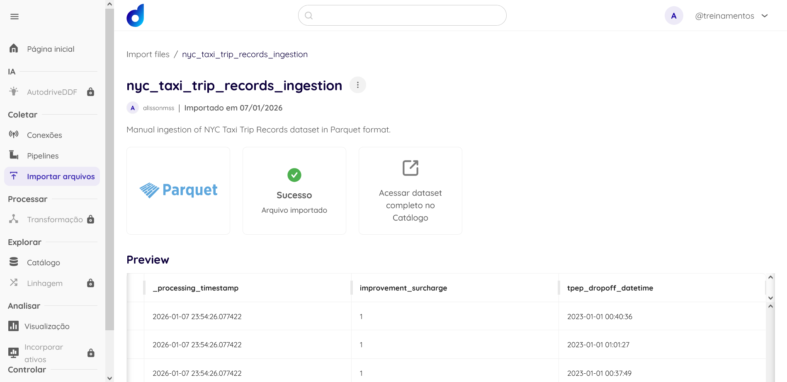
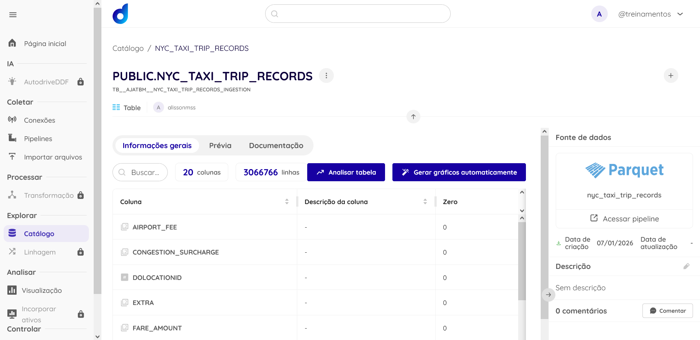
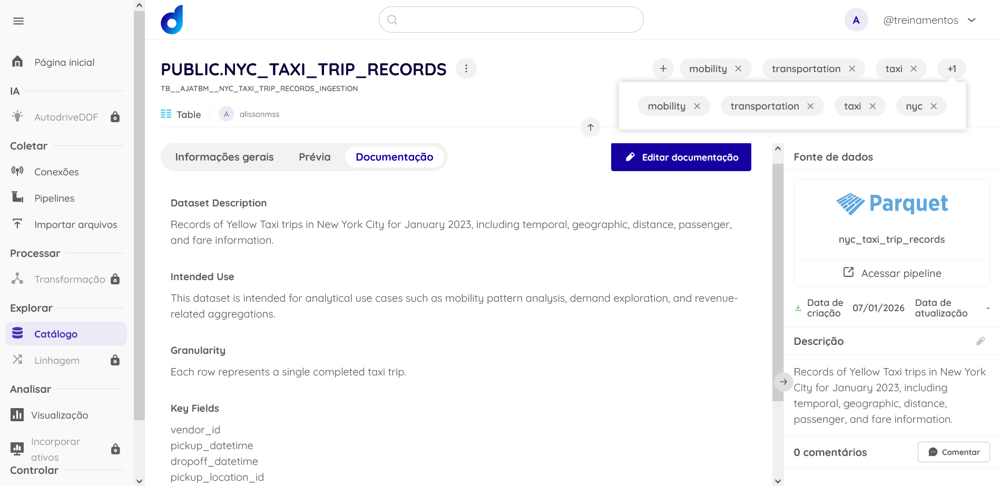
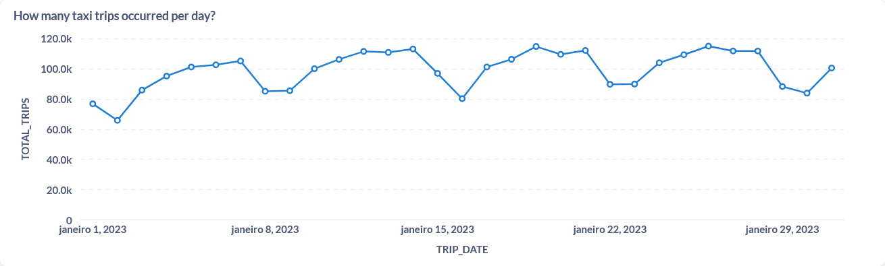
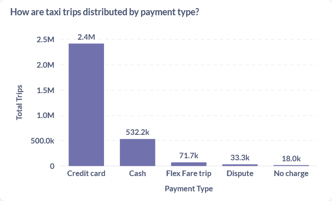
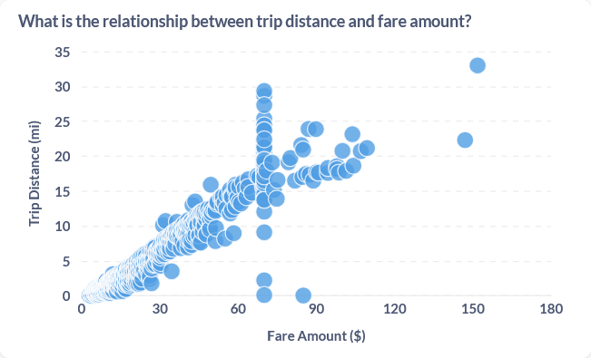
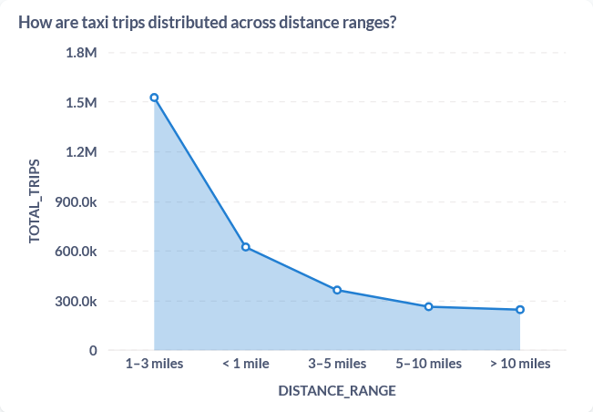
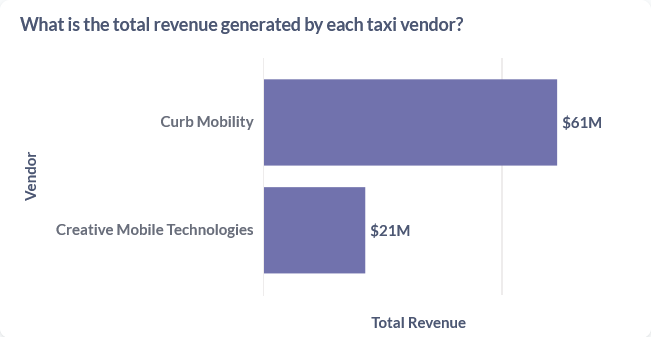

# Technical Case – Dadosfera

This repository contains the technical case developed for the Dadosfera selection process, demonstrating an end-to-end data lifecycle using the Dadosfera platform.

## Dataset
This case uses the NYC Taxi Trips dataset. The analysis focuses on a temporal subset covering **January 2023**.

## Project Scope
The project follows the data lifecycle approach, covering ingestion, exploration, data quality, and analytical visualization.


## Item 0 – Project Planning

The project planning was organized using a Kanban board in Jira, following agile principles and a Kanban-based workflow.

Below is a screenshot of the Kanban board used during the project execution.




## Item 1 – Dataset Selection and Description

### Dataset Description
For this technical case, the **NYC City Taxi Trip Records** dataset was selected. This dataset is publicly available and contains detailed information about taxi trips performed in New York City.

Each record represents a single taxi trip, including attributes related to time, location, distance, passenger count, and fare values.

---

### Dataset and Volume
The NYC Taxi dataset contains **millions of records**, therefore fully complying with the requirement of having more than **100,000 records**, as specified in the case instructions.

---

### Domain Representation
The dataset represents the **urban mobility and transportation domain**, allowing analyses related to operational behavior, temporal patterns, and revenue distribution. This makes it suitable for demonstrating an end-to-end analytical data workflow within the proposed scenario.

This dataset was selected among the examples suggested in the case description.


## Item 2 – Data Integration

### Ingestion Asset
An ingestion asset was created using the **Novo arquivo** option available in the *Coletar > Importar arquivos* module.

The dataset was imported in Parquet format.

**Ingestion Asset Details:**
- **Name:** nyc_taxi_trip_records
- **Description:** manual ingestion of NYC Taxi Trip Records dataset

---

### Dataset Upload
After the upload process, the dataset became available as a table within the Dadosfera environment.



The dataset is available here:

[NYC Taxi Trip Records Dataset](https://app.dadosfera.ai/pt-BR/catalog/data-assets/9f5d53fe-f133-42f8-8c6f-675629652512)

---

### Initial Validation
After ingestion, a basic validation was performed to confirm successful loading, correct schema recognition, and data availability for downstream analysis.

The dataset is ready for the exploration and cataloging phase.




## Item 3 – Data Exploration and Cataloging

### Dataset Cataloging
The dataset was cataloged with descriptive metadata, domain-related tags, and temporal reference to support discovery and exploration.

---

### Data Lake Logical Organization
Within the logical Data Lake architecture, the NYC Taxi Trip Records dataset is classified as part of the **Landing Zone**, representing raw ingested data preserved in its original structure.

---

- Dataset catalog view




## Item 4 – Data Quality

### Data Quality Assessment
A data quality assessment was performed on the **nyc_taxi_trip_records** dataset to identify inconsistencies, missing values, and potential issues that could affect downstream analyses.

The assessment was conducted using **YData Profiling** (formerly pandas-profiling).

---

### Data Quality Report
The full interactive report is available here:

[nyc_taxi_trip_records – Data Quality Report](docs/nyc_taxi_trip_records_data_quality_report.html)

---

### Key Findings
The data quality analysis highlighted the following points:

- Strong expected correlations between fare-related variables (`fare_amount`, `total_amount`, `tip_amount`, `trip_distance`).
- Some categorical fields present high imbalance, such as `improvement_surcharge` and `store_and_fwd_flag`.
- Approximately 2.3% of missing values were identified in fields like `passenger_count`, `RatecodeID`, and `airport_fee`.
- Numeric variables such as `trip_distance` show skewed and zero-inflated distributions.

These aspects should be considered in data preparation steps prior to downstream analyses.


## Item 7 – Data Analysis and Visualization

### Dashboard Overview
A dashboard was created in the Dadosfera Visualization module (Metabase) to support data-driven insights over the **nyc_taxi_trip_records** dataset.

The dashboard combines **categorical analysis** and **time-series analysis**, addressing different analytical questions related to taxi operations, payment behavior, and revenue patterns.

The dashboard is available here:
[**NYC Taxi Trips for January 2023**](https://metabase-treinamentos.dadosfera.ai/dashboard/254-nyc-taxi-trips-for-january-2023)

---

### Visualization 1 – Total Trips per Day
Presents the daily volume of taxi trips throughout January 2023, allowing the identification of temporal patterns and daily fluctuations in demand.

- **SQL query:**
```sql
SELECT
	DATE(tpep_pickup_datetime) AS trip_date,
	COUNT(*) AS total_trips
FROM TB__AJATBM__NYC_TAXI_TRIP_RECORDS_INGESTION
	WHERE tpep_pickup_datetime >= '2023-01-01'
	AND tpep_pickup_datetime < '2023-02-01'
GROUP BY DATE(tpep_pickup_datetime)
ORDER BY trip_date;
```



---

### Visualization 2 – Trips by Payment Type
Shows the distribution of taxi trips by payment method, highlighting customer payment preferences.

- **SQL query:**
```sql
SELECT
	payment_type,
	COUNT(*) AS total_trips
FROM TB__AJATBM__NYC_TAXI_TRIP_RECORDS_INGESTION
WHERE tpep_pickup_datetime >= '2023-01-01'
	AND tpep_pickup_datetime < '2023-02-01'
GROUP BY payment_type
ORDER BY total_trips DESC;
```



---

### Visualization 3 – Relationship Between Trip Distance and Fare Amount
Explores the relationship between trip distance and fare amount, validating expected correlations between these variables.

- **SQL query:**
```sql
SELECT
	trip_distance,
	fare_amount
FROM TB__AJATBM__NYC_TAXI_TRIP_RECORDS_INGESTION
WHERE tpep_pickup_datetime >= '2023-01-01'
	AND tpep_pickup_datetime < '2023-02-01'
	AND trip_distance > 0
	AND fare_amount > 0;
```



---

### Visualization 4 – Distribution of Trip Distance Ranges
To analyze trip distance distribution, distance ranges were defined directly in the query, enabling a histogram-like analysis.

- **SQL query:**
```sql
SELECT
	CASE
		WHEN trip_distance < 1 THEN '< 1 mile'
		WHEN trip_distance >= 1 AND trip_distance < 3 THEN '1–3 miles'
		WHEN trip_distance >= 3 AND trip_distance < 5 THEN '3–5 miles'
		WHEN trip_distance >= 5 AND trip_distance < 10 THEN '5–10 miles'
		ELSE '> 10 miles'
	END AS distance_range,
	COUNT(*) AS total_trips
FROM TB__AJATBM__NYC_TAXI_TRIP_RECORDS_INGESTION
WHERE tpep_pickup_datetime >= '2023-01-01'
	AND tpep_pickup_datetime < '2023-02-01'
	AND trip_distance > 0
GROUP BY distance_range
ORDER BY total_trips DESC;
```



---

### Visualization 5 – Total Revenue by Vendor
Compares the total revenue generated by each taxi vendor during the selected period, supporting performance comparison between vendors.

- **SQL query:**
```sql
SELECT
	VendorID,
	SUM(total_amount) AS total_revenue
FROM TB__AJATBM__NYC_TAXI_TRIP_RECORDS_INGESTION
WHERE tpep_pickup_datetime >= '2023-01-01'
	AND tpep_pickup_datetime < '2023-02-01'
GROUP BY VendorID
ORDER BY total_revenue DESC;
```



---

### Final Considerations
The dashboard delivers an integrated analytical view of the dataset, combining temporal behavior, categorical distributions, and variable relationships.
These visualizations support exploratory analysis and contribute to the generation of insights that can inform downstream analytical or decision-making processes.
